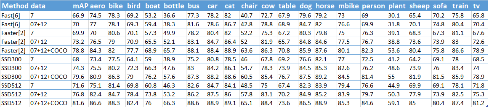
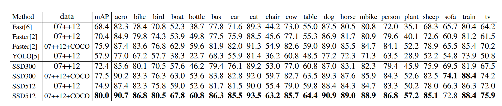
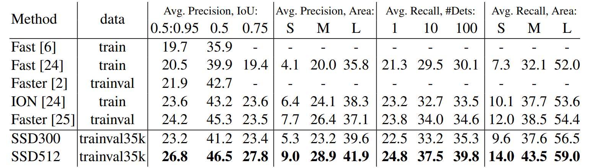
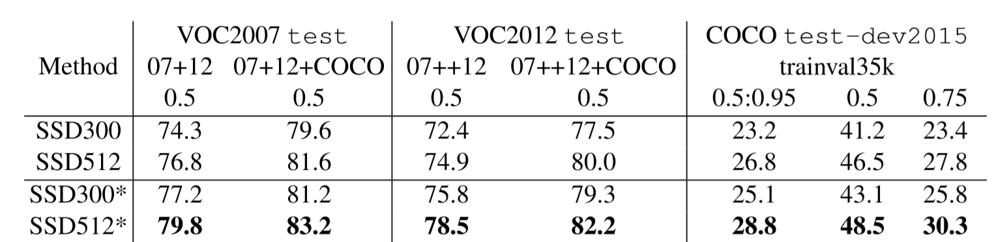
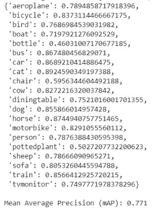

# SSD Object Detection Algorithm Overview
## A. Concepts
[GitHub](http://github.com)
- __Object Detection__ Object detection is a computer technology related to computer vision and image processing that deals with detecting instances of semantic objects of a certain class (such as humans, buildings, or cars) in digital images and videos.
- __Single Shot Detection__ Single-shot models encapsulate both localization and detection tasks in a single forward sweep of the network, resulting in significantly faster detections while deployable on lighter hardware.
- __Multiscale Feature Maps__ In object detection, feature maps from intermediate convolutional layers can be directly useful because they represent the original image at different scales. Therefore, a fixed-size filter operating on different feature maps will be able to detect objects of various sizes.
- __Priors__ These are pre-computed boxes defined at specific positions on specific feature maps, with specific aspect ratios and scales. 
- __Multibox__ This is a technique that formulates predicting an object's bounding box as a regression problem, wherein a detected object's coordinates are regressed to its ground truth's coordinates. In addition, for each predicted box, scores are generated for various object types.
- __Hard Negative Mining__  This refers to explicitly choosing the most egregious false positives predicted by a model and forcing it to learn from these examples.
- __Non-Maximum Suppression__ Non-Maximum Suppression (NMS) is a means to remove redundant predictions by suppressing all but the one with the maximum score.

## B. Overview
The SSD is a purely convolutional neural network (CNN) that we can organize into three parts –

1. Base convolutions derived from an existing image classification architecture that will provide lower-level feature maps.

2. Auxiliary convolutions added on top of the base network that will provide higher-level feature maps.

3. Prediction convolutions that will locate and identify objects in these feature maps.

The paper demonstrates two variants of the model called the SSD300 and the SSD512. The suffixes represent the size of the input image. Although the two networks differ slightly in the way they are constructed, they are in principle the same. The SSD512 is just a larger network and results in marginally better performance.
          

# 1. Results Summary of the SSD Research Paper.
- Experiments in the paper are all based on VGG16, which is pre-trained on the ILSVRC CLS-LOC dataset. 
- SSD object detection algorithm is tested on PASCAL VOC 2007 daataset(4952 images). These results are comparaed against two famous object detection algorithms i,e, Fast R-CNN and Faster R-CNN.

## A. PASCAL VOC2007 Dataset Test Results.
- SSD is tested on PASCAL VOC 2007 dataset(4952 images). These results are comparaed against two object detection algorithms i.e. Fast R-CNN and Faster R-CNN.
- This data contains images with twenty different types of objects {'aeroplane', 'bicycle', 'bird', 'boat', 'bottle', 'bus', 'car', 'cat', 'chair', 'cow', 'diningtable', 'dog', 'horse', 'motorbike', 'person', 'pottedplant', 'sheep', 'sofa', 'train', 'tvmonitor'}
- SSD model with input image size 300x300 (SSD300) is more accurate than Fast R-CNN. 
- When SSD is trained on a larger 512×512 input image (SSD512), it is even more accurate, surpassing Faster R-CNN by 1.7% mAP.  
- SSD model trained with more data (VOC 07+12), SSD300 is performed better than Faster R-CNN by 1.1% and that SSD512 is 3.6% better. 
- SSD Model trained on COCO trainval35k and fine-tuned on the VOC 07+12 dataset achieved the best results (highest score): 81.6% mAP. 

Both Fast and Faster R-CNN use input images whose minimum dimension is 600.The two SSD models have exactly the same settings except that they have different input sizes (300×300 vs. 512×512). It is obvious that larger input size leads to better results, and more data always helps. Data: ”07”: VOC2007 trainval, ”07+12”: union of VOC2007 and VOC2012 trainval. ”07+12+COCO”: first train on COCO trainval35k then fine-tune on 07+12.

## B. PASCAL VOC2012 Dataset Test Results
- SSD300 improves accuracy over Fast/Faster RCNN. By increasing the training and testing image size to 512×512, we are 4.5% more
accurate than Faster R-CNN. 
- Compared to YOLO, SSD is significantly more accurate, likely due to the use of convolutional default boxes from multiple feature maps and our
matching strategy during training.

PASCAL VOC2012 test detection results. Fast and Faster R-CNN use images with minimum dimension 600, while the image size for YOLO is 448 × 448. data: ”07++12”: union of VOC2007 trainval and test and VOC2012 trainval.07++12+COCO”: first train on COCO trainval35k then fine-tune on 07++12.

## C. COCO test-dev2015 detection results.
- SSD300 is better than Fast R-CNN in both mAP@0.5 and mAP@[0.5:0.95]. SSD300 has a similar mAP@0.75 as ION and Faster R-CNN, but is worse in mAP.
- It is also observed that SSD512 is 5.3% better in mAP@0.75, but is only 1.2% better in mAP@0.5. t it has much better AP (4.8%) and AR (4.6%) for large objects, but has relatively less improvement in AP (1.3%) and AR (2.0%) for small objects.

 

## D. Data Augmentation for improving Small Object Accuracy Results
- Without a follow-up feature resampling step as in Faster R-CNN, the classification task for small objects is relatively hard for SSD.
- The data augmentation strategy helps to improve the performance dramatically, especially on small datasets such as PASCAL VOC.
-Zoom in and zoom out operation trick is used that creates more training examples
- There is a consistent increase of 2%-3% mAP across multiple datasets, as shown in Table below. In specific, it shows that the new augmentation trick significantly improves the performance on small objects

# 2.  Procedure taken to Reproduce the Results.(Our Procedure and Results to reproduce the SSD algorithm)
- __Step1__  Literature review was done of other object detection methods like R-CNN, Faster R-CNN and YOLO(You Only Look Once).
- __Step2__ The SSD model implementation is done using deep learning framework. For model building, we referred 2 open source codes on github.
  - Open Source Codes Referred - 
     -     
     -
- __Step3__  __Building model in PyTorch__
  - __A. Inputs to the model__
           There are three inputs to our SSD model: Images, ground truth object bounding boxes and Object's labels
  - __B.Data Pipeline__
          Our data is divided into training and test splits. 
  - __Steps followed for model implementation-__
   - Data Transforms
   - PyTorch DataLoader
   - Base network(VGG 16 is used as the base network)
   - Auxiliary Convolutions
   - Prediction Convolutions
   - Prior
   - Multi Loss
   - Software Framework used: PyTorch
   - Model trained on Google Colab.
- __Step4__ __Training-__
      - Trained the SSD model on two different datasets (PASCALVOC2007 Train, PASCALVOC2012 Train) using google colab GPU. 
      - In the paper, authors used Stochastic Gradient Descent in batches of 32 images, with an initial learning rate of 1e−3, momentum of 0.9, and 5e-4 weight decay. We used a batch size of 8 images for increased stability.
- __Step5__ Testing and evaluation
  - Tested the SSD model on two different datasets. (PASCAL VOC2007 Test, PASCAL VOC2012 Test).
  - Parsed predictions are evaluated against the ground truth objects. The evaluation metric is the Mean Average Precision (mAP).

# 3.  Describes measurements and/or analysis of what was discovered when attempting to reproduce result.
- Our analysis and Model analysis.
SSD TEst Results on VOC 2007

- After training our SSD model, and testing it on bot PASCAL VOC datasets, we found that our accuracy and mAP were very close to the results that the authors got.

# 4.  Discussion and References to relevant papers.
- Object detection is the combined task of object localization (providing bounding boxes) and classification (labelling), in an Image. Typical Convolutional Neural Network (CNN) architecture, VGG16  [1] is the most representative model for deep learning.  

- VGG16 [1] architecture constitutes of multiple layers (13 conv. layers, 3 fully connected layers with softmax activation for classification, 3 max. pooling layers and 2 stride max pooling layers; where each layer is termed as a feature map. The input is an image constituting a three-dimensional matrix of pixel intensities of RGB.  Filtering and Pooling are the transformation operations performed on the feature maps. Every neuron of a particular layer is connected to a fraction of neurons of the previous layer termed as the receptive filed. Filtering is the process of convolution of filter coefficients with the receptive field and its output passes through a nonlinear function such as ReLU/Sigmoid to obtain its overall response. Pooling type may be max, average or of L2. Pooling with local contrast normalization gives a single value which represents the robust feature description. The overall architecture intertwines filtering and pooling, which can be fine-tuned using fully connected layers by supervised learning methods. Based on different tasks, activation function at the output layer, categorizes the pixel. The network is optimized on an objective function (mean-squared error, cross -entropy loss) suing Stochastic Gradient Descent method.  This architecture which combinedly optimizes the problem of classification and regression, provides a good expressive capability and allows us to solve computer vision problems using a different perspective. 

- Object detection falls into two broad categories- region based and classification/regression methods. A thorough study of the same is presented in [1]. 

- Region proposal-based methods mimics the technique adopted by human brain which takes a glimpse of the overall picture and then concentrates on the region of interest.  

- There is a plethora of these methods, but discussion in onto methods Region with CNN feature (R-CNN) [2], Spatial Pyramid Pooling Network (SPP-Net) [3], Fast R-CNN [4] and Faster R-CNN [5].  

- R-CNN [2] does a selective search to obtains region proposals, generates feature map using CNN and classifies the region using a linear SVM. Its advantages are increased accuracy due to high capacity CNN, and reduction in the search space owing to supervised training for classification and subsequently fine tuning for detection task. Its main disadvantage is content losses, due to fixed size input (for fully connected layers), when the objects occurs at different scales.  

- This is overcome by spatial pyramid matching architecture in SPP-Net [3], which uses quantization of a fine to coarse region, at different scales. Thus, leading to an increase in speed and detection efficiency at testing period. The limitation of this method is its accuracy as it has fixed convolutional network layer. 

- Fast R-CNN [4] shows an improvement in the speed (training and testing) and accuracy, owing to the aspect of no feature caching and all the network layers being updated during training (single-stage) respectively. 

- Faster R-CNN [5] architecture includes a region proposal network prior to that in Fast R-CNN. This unified frame work achieves good accuracy for near real-time frame rates. 

- Though classification and regression forms integral part of the region-based method, there is a single step framework based on global regression/classification which maps image pixels to bounding box coordinates and class probabilities. These fall under the umbrella of regression/classification methods for object detection. YOLO [6] and Single Shot MultiBox Detector (SSD) [7] are two classic methods under this category. 

- You Only Look Once (YOLO) [6] initially resizes the image which is fed as input to a single convolutional network. It detects objects based on confidence scores specific to a class, both at one go. This leads to an extremely fast detection but cannot handle images of unusual aspect ratio (due to several down sampling layers) as well as small objects appearing in groups (due to space constraint on bounding boxes). 

- This speed-accuracy trade-off is circumvented by a method termed as SSD [7]. This is accomplished by adding several feature layers at the end, VGG16 forming the backbone network, the additional layers can conveniently make predictions and determine the associated probabilities on the bounding box offset, thus tackling the problem arising out of varying scales and aspect ratios.  

- A set of grids is created on an input image. A couple of rectangles of different aspect ratios are made around those grids. Filtering operation is carried out in the region described by the bounding box in order find the presence of an object. The size of the image gets reduced drastically at the layers present at the end. The operations of convolution and detection is carried out at every step, such that even the smaller objects get easily identified. The SSD algorithm also knows how to go back from one convolution operation to another. It not only learns to go forward but backwards too.  

- Thus, providing increased speed and accuracy more than YOLO, even when the input image is of smaller size. Some of the limitations of SSD are to improve accuracy, data augmentation is very much essential, a greater number of default boxes are needed, and atrous convolution is needed at the last two layers in the VGG16 used therein, without which the model tends to be slower. Application of SSD, the state-of- the art technique for object detection is currently being studied for object tracking also. 

 

References: 

[1] Z.-Q. Zhao, P. Zheng, S.-T. Xu, and X. Wu, ‘‘Object detection with deep learning: A review,’’ IEEE Trans. on Neural Networks and Learning Systems, Volume: 30, Issue: 11 , Nov. 2019.  [paper](https://arxiv.org/pdf/1807.05511) 

 

[2] R. Girshick, J. Donahue, T. Darrell, and J. Malik, "Rich feature hierarchies for accurate object detection and semantic segmentation." Proceedings of the IEEE conference on Computer Vision and Pattern Recognition. 2014. [paper](https://www.cv-foundation.org/openaccess/content_cvpr_2014/papers/Girshick_Rich_Feature_Hierarchies_2014_CVPR_paper.pdf) 

  

[3] He, Kaiming, et al. "Spatial pyramid pooling in deep convolutional networks for visual recognition." IEEE transactions on pattern analysis and machine intelligence 37.9 (2015): 1904-1916. [paper](https://arxiv.org/abs/1406.4729) 

 

[4] R. Girshick, “Fast r-cnn,”, ICCV, 2015. [paper](https://arxiv.org/pdf/1504.08083) 

 

[5] S. Ren, K. He, R. Girshick, and J. Sun, “Faster r-cnn: Towards realtime object detection with region proposal networks,” in NIPS, 2015, pp. 91–99.  [paper](https://arxiv.org/pdf/1506.01497) 

 

[6] J. Redmon, S. Divvala, R. Girshick, and A. Farhadi, “You only look once: Unified, real-time object detection,” CVPR, 2016. [paper](https://arxiv.org/abs/1506.02640) 

 

[7] W. Liu, D. Anguelov, D. Erhan, C. Szegedy, S. Reed, C.-Y. Fu, and A. C. Berg, “Ssd: Single shot multibox detector,” ECCV, 2016.  [paper](https://arxiv.org/abs/1512.02325) 

 

 
 
# 5.  Results and Conclusion.
- Our results and limitations and remedies. (Report) 
