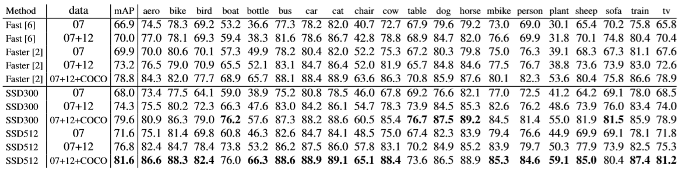

# SSD Object Detection Algorithm Overview
## A. Concepts
- __Object Detection__ Object detection is a computer technology related to computer vision and image processing that deals with detecting instances of semantic objects of a certain class (such as humans, buildings, or cars) in digital images and videos.
- __Single Shot Detection__ Single-shot models encapsulate both localization and detection tasks in a single forward sweep of the network, resulting in significantly faster detections while deployable on lighter hardware.
- __Multiscale Feature Maps__ In object detection, feature maps from intermediate convolutional layers can be directly useful because they represent the original image at different scales. Therefore, a fixed-size filter operating on different feature maps will be able to detect objects of various sizes.
- __Priors__ These are pre-computed boxes defined at specific positions on specific feature maps, with specific aspect ratios and scales. 
- __Multibox__ This is a technique that formulates predicting an object's bounding box as a regression problem, wherein a detected object's coordinates are regressed to its ground truth's coordinates. In addition, for each predicted box, scores are generated for various object types.
- __Hard Negative Mining__  This refers to explicitly choosing the most egregious false positives predicted by a model and forcing it to learn from these examples.
- __Non-Maximum Suppression__ Non-Maximum Suppression (NMS) is a means to remove redundant predictions by suppressing all but the one with the maximum score.

## B. Overview
The SSD is a purely convolutional neural network (CNN) that we can organize into three parts –

1. Base convolutions derived from an existing image classification architecture that will provide lower-level feature maps.

2. Auxiliary convolutions added on top of the base network that will provide higher-level feature maps.

3. Prediction convolutions that will locate and identify objects in these feature maps.

The paper demonstrates two variants of the model called the SSD300 and the SSD512. The suffixes represent the size of the input image. Although the two networks differ slightly in the way they are constructed, they are in principle the same. The SSD512 is just a larger network and results in marginally better performance.

# 1. Results Summary of the SSD Research Paper.
- For all experiments pretrained VGG16 is used, which is pretrained on ILSVRC CLS-LOC dataset. 
## A. PASCAL VOC2007 Dataset Test Results.
- SSD is tested on PASCAL VOC 2007 daataset(4952 images). These results are comparaed against two object detection algorithms i.e. Fast R-CNN and Faster R-CNN.
- SSD model with image size 300x300 (Low resolution SSD300) is more accurate than Fast R-CNN. 
- When SSD is trained on a larger 512×512 input image, it is even more accurate, surpassing Faster R-CNN by 1.7% mAP.  
- 

Both Fast and Faster R-CNN use input images whose minimum dimension is 600.The two SSD models have exactly the same settings except that they have different input sizes (300×300 vs. 512×512). It is obvious that larger input size leads to better results, and more data always helps. Data: ”07”: VOC2007 trainval, ”07+12”: union of VOC2007 and VOC2012 trainval. ”07+12+COCO”: first train on COCO trainval35k then fine-tune on 07+12.

## B. PASCAL VOC2012 Dataset Test Results

## C. COCO test-dev2015 detectionresults.
## D. Data Augmentation for Small Object Accuracy Results

# 2.  Procedure taken to Reproduce the Results.(Our Procedure and Results to reproduce the SSD algorithm)

# 3.  Describes measurements and/or analysis of what was discovered when attempting to reproduce result.
# 4.  Discussion and References to relevant papers.
# 5.  References.

